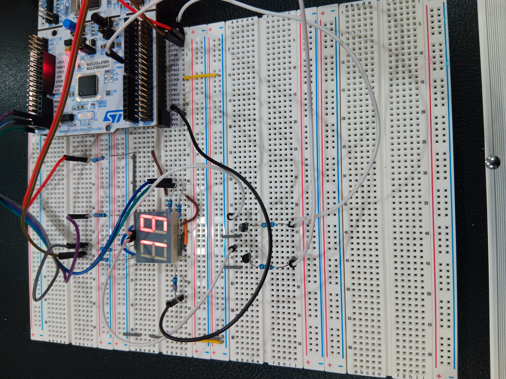
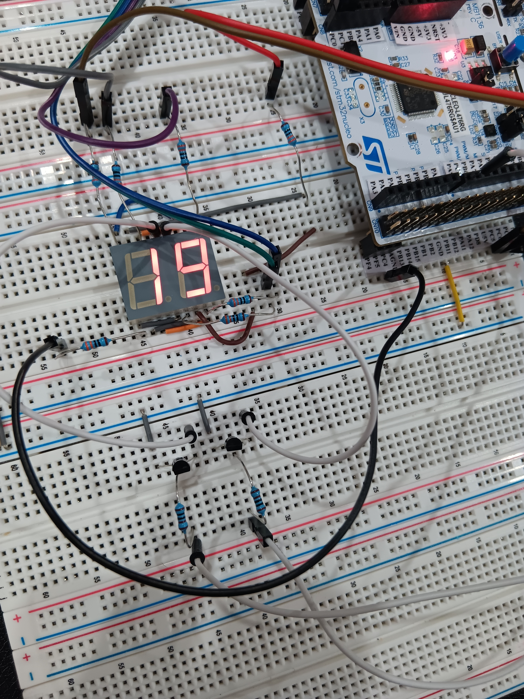

# Two Digits 7 Segment Display

## Overview
This project demonstrates how to drive a two-digit 7-segment LED display using the STM32L476 NUCLEO development board.

The system clock is configured to run at 80 MHz. GPIO pins are configured as outputs using STM32CubeMX, and the display is controlled through direct GPIO register access.

The two digits are driven using multiplexing, where each digit is activated alternately at a high refresh rate to create the appearance of a continuous display.

## Hardware

- STM32 NUCLEO-L476RG Development Board
- DC56-11EWA Two-Digit 7-Segment LED Display
- 2 × 2N2222A NPN Transistors
- Current Limiting Resistors
- Breadboard
- Jumper Wires

## Features

- Two-digit 7-segment display control
- GPIO-based segment driving
- Direct GPIO ODR register manipulation
- Multiplexed display operation
- Displays decimal values from 00 to 99

## Multiplexing Method

The display uses a multiplexing technique to control both digits using a shared set of segment lines.

Digit select pins are controlled through transistor drivers. Each digit is enabled for a short period while the corresponding segment pattern is applied. The process is repeated continuously to maintain a stable display.

For example, to display the number 19:

MSD = 1
LSD = 9

## Segment Connections

| Function | STM32 Pin | Display Pin |
|----------|-----------|-------------|
| Segment a | PC0 | 16 |
| Segment b | PC1 | 15 |
| Segment c | PC2 | 3 |
| Segment d | PC3 | 2 |
| Segment e | PC4 | 1 |
| Segment f | PC5 | 18 |
| Segment g | PC6 | 17 |
| Digit 1 Enable | PC7 | 14 |
| Digit 2 Enable | PC8 | 13 |

## Project Structure

| Folder | Description |
|----------|-------------|
| Core | Application source and header files |
| Drivers | STM32 HAL and CMSIS drivers |
| Docs | Project documentation and schematic |
| Images | Hardware setup photos |

## Images

## Documentation

[Schematic PDF](Two_Digits_7_Segment/Docs/two_digits_7_segment_schematic.pdf)

## Development Environment

- STM32CubeIDE
- STM32CubeMX
- STM32 HAL Drivers
